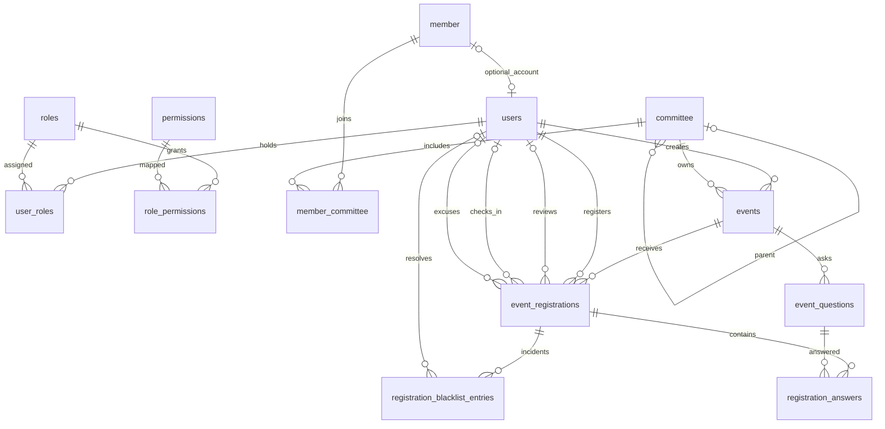

# Core Database Design Review

Status: business decisions approved in chat; the user authorized table definitions on 2026-10-09. All thirteen Prisma models are now defined. Migration SQL, custom CHECK constraints and database application remain pending.

## Goal and scope

Give all backend developers the same PostgreSQL structure for accounts, membership, authorization, event creation, registration, and PR review. Keep the 12 green tables assigned to person 1 as the core. The subsequently approved warning history requires an additional related table; its exact structure remains proposed.

Observed implementation as of 2026-10-09: PostgreSQL 17, Prisma 7.10.0, thirteen Prisma models with relationships/uniqueness/indexes, a NestJS connection, and no committed migrations. Custom SQL CHECK constraints and feature logic are not implemented by the model definitions. The current frontend uses local models/mock data rather than a published API contract.

Sources reviewed:

- `GDGoC_Database_Schema.docx`: table definitions and green cell shading.
- `GDG_UJ_Backend_Workflow (1).pdf`: authentication and event workflow.
- The user's pasted five-person task allocation: explicit nullable membership, registration states, confirmation, capacity, and waitlist requirements.
- Repository architecture, database, authorization, configuration, and frontend event/signup forms.

Instructions inside source documents are requirements evidence, not authorization to deploy, change authentication providers, or apply migrations. The latest user request authorizes defining the tables in the Prisma schema; database application remains a later step.

## Approach

Recommended: preserve the 12 source table names and integer IDs, use normalized relationships, and add only fields/constraints needed by the current workflow. Map camelCase Prisma fields to snake_case database columns with `@map` and models to source table names with `@@map`.

Alternatives considered:

- Copy the DOCX literally: least initial work, but retains conflicting authentication, status, creator, and missing-choice definitions. Not sufficient for the assigned workflow.
- Model every future domain now: adds applications, attendance, skills, files, tasks, and AI before their requirements are settled. Defer these blue tables.

## Source discrepancies and proposed resolutions

| Topic | Evidence | Proposed resolution |
| --- | --- | --- |
| Signup membership | PDF assigns MEMBER; task allocation explicitly creates users only | No member record or MEMBER grant on public signup; enrollment is separate |
| Authentication storage | DOCX says Supabase Auth and no local hash; PDF describes backend hashing; task allocation mentions Supabase invitation/reset | User confirmed Supabase Auth on 2026-10-05; no local password hash |
| Event creator | DOCX organizer_id references member; PDF created_by references users | Use required `created_by -> users.user_id`, derived from authenticated user; no duplicate organizer column |
| Registration states | DOCX type says registered/cancelled; notes and task allocation specify review/confirmation/waitlist | Use the twelve approved states below; later user decisions supersede the original seven-state allocation |
| Event deletion | Endpoint says delete; PDF recommends preserving registrant history | Recommend cancellation and restrict hard deletion when registrations exist; team review required |
| Names for non-members | DOCX stores full_name only in member; signup collects a name for users-only accounts | Add required users.full_name; member.full_name remains the membership directory record |
| Question choices | DOCX lists choice types but no storage for choices; frontend collects options | Add ordered JSONB options on event_questions; define validation and answer encoding |
| Event schedule | DOCX has date/time; PDF mentions start/end; frontend currently has one time | Propose required starts_at/ends_at TIMESTAMPTZ(3), replacing date/time/end_time; supports both workshops and multi-day camps |
| Authorization vocabulary | Legacy docs use organizer/admin; current allocation uses leader + committee | Seed only confirmed current roles; committee role must govern committee actions |

## Proposed conventions

- Keys: `Int`, PostgreSQL identity/sequence-backed autoincrement. No UUID rewrite of source IDs.
- `?` below means nullable; other fields are required unless a default is specified.
- Text bounds follow source definitions; descriptions and URLs can use TEXT where no business length is established.
- Instants: `DateTime @db.Timestamptz(3)`; store UTC and display in Asia/Riyadh. Calendar-only membership dates: `@db.Date`.
- Proposed event schedule: required starts_at/ends_at instants, displayed in Asia/Riyadh. This supports cross-midnight and multi-day camps without separate date/time authorities; review this source-schema change before implementation.
- IDs are immutable (`onUpdate: Restrict`). All delete actions are explicit below.
- Email proposal: users.email is unique and CHECK requires email = lower(btrim(email)) and a nonempty value. Normalize before writes; direct noncanonical writes fail. Use one Prisma-visible unique index, with no redundant expression index. This is canonical storage, not email-address syntax validation.
- Preserve source stored vocabulary through enum value @map: event statuses draft/published/completed/cancelled, member types current/alumni, question types text/select/radio/checkbox, and committee roles Leader/Co-Leader/Coordinator/Member. Prisma enum symbols remain uppercase. The twelve new registration statuses are stored uppercase as agreed; trim incidental whitespace in the source enum examples.
- No API naming contract is published by this document; API DTOs will map UI payloads to these models.

## The 12 tables

### 1. users

`user_id` PK; `member_id?` unique FK; `full_name` VARCHAR(150); `email` VARCHAR(255); `phone_number?` VARCHAR(20); `is_active` default true; `is_verified` default false; `last_login?`; `created_at` default now; `updated_at` managed by Prisma.

`member_id` is optional and unique: a user has zero or one member profile, and a member profile has zero or one linked account. Existing membership records can precede accounts. Deleting a linked member is restricted; account deactivation preserves its links.

Authentication decision: Supabase Auth, confirmed by the user on 2026-10-05. Add nullable unique `auth_user_id` UUID; no `password_hash`. Existing member/account records may precede invitation and provider linkage. A NULL auth_user_id does not establish an authenticated identity.

The external UUID is not a foreign key to a locally assumed `auth.users` table: local PostgreSQL runs separately from Supabase. NestJS verifies the provider token and resolves its subject to users.auth_user_id before loading local membership and authorization. Never trust a UUID/role supplied in request bodies. Provider credentials remain outside source control.

Supabase owns credential and email-verification state. Local is_verified/last_login are synchronized metadata, not independent proof of provider authentication. Public signup creates a linked local user only after the provider flow succeeds; it does not create membership. Provider and local writes cannot share a PostgreSQL transaction: person 2 must design idempotent provisioning/linking and recovery for partial failures, with uniqueness protecting duplicate subjects/emails.

The PDF password-NULL/password-hash check is superseded. Do not infer PASSWORD_SETUP_REQUIRED from a missing local hash. Invitation/reset/setup-state handling must be designed with person 2 using supported Supabase APIs; no credential copies or inspecting provider password hashes.

### 2. roles

`role_id` PK; `role_name` VARCHAR(50) unique; `description?` TEXT.

Candidate source roles: Advisor, Group Leader, Group Co-Leader, Developers Committee Leader, Committee Leader, Committee Co-Leader, Member. Confirm stable codes and exact active set before seeding. No automatic MEMBER grant to non-members.

### 3. user_roles

`id` PK; `user_id` FK; `role_id` FK; `assigned_at` default now; unique `(user_id, role_id)`.

Delete user: Cascade association; delete assigned role: Restrict. The pair's index serves lookup by user; add role_id index for role assignment lookup.

### 4. permissions

`permission_id` PK; `permission_name` VARCHAR(100) unique; `description?` TEXT.

Candidate permissions from current endpoints: view_events, register_event, view_own_registrations, create_event, publish_event, update_event, cancel_event, view_registrations, approve_registration, reject_registration, manage_waitlist, view_attendance, check_in_attendance. These are proposals, not approved grants. Public event reads do not require a user role.

### 5. role_permissions

`id` PK; `role_id` FK; `permission_id` FK; unique `(role_id, permission_id)`.

Delete role: Cascade association; delete assigned permission: Restrict. Index permission_id for inverse lookup.

### 6. member

`member_id` PK; `full_name` VARCHAR(150); `phone_number?` VARCHAR(20); `email_personal?` VARCHAR(255); `email_university?` VARCHAR(255) unique; `university?` VARCHAR(150); `branch?` VARCHAR(20); `major?` VARCHAR(100); `profile_image_url?` VARCHAR(255); `bio?` TEXT; `member_type` CURRENT/ALUMNI default CURRENT; `join_date?` DATE; `is_active` default true.

Branch, when provided, is one of MAIN_M, MAIN_F, KHL_M, KHL_F. Source indicates existing member data but no local import or official database DDL was provided; no existing production compatibility is assumed.

Account identity and membership directory fields have separate meaning. Keep users.email as the login address; do not infer authorization from member email fields. Name/phone updates need an explicit owning service to avoid accidental conflicting edits.

### 7. committee

`committee_id` PK; `committee_name` VARCHAR(100) unique; proposed `committee_code` VARCHAR(50) unique; `parent_committee_id?` self FK.

Code provides stable DATA_ANALYSIS/PR comparisons independent of display name. Delete parent: Restrict. Check parent is not self; backend also prevents longer cycles. Index parent_committee_id for child committee lookup.

Seed DATA_ANALYSIS and PR plus other committees only when their exact approved hierarchy/codes are supplied. No invented committee tree.

### 8. member_committee

`id` PK; `member_id` FK; `committee_id` FK; `role` LEADER/CO_LEADER/COORDINATOR/MEMBER; unique `(member_id, committee_id)`.

Delete member: Cascade association; delete populated committee: Restrict. Index `(committee_id, role)` for committee roster/leadership queries.

A member can belong to multiple committees. A leader role in one committee must never grant leadership in another: require the role on the matching member_committee row. Global user_roles cannot substitute for this scope check.

### 9. events

`event_id` PK; `name` VARCHAR(200); `description?` TEXT; proposed `starts_at` TIMESTAMPTZ(3); proposed `ends_at` TIMESTAMPTZ(3); `location?` VARCHAR(255); `capacity` positive INT; `registration_deadline` TIMESTAMPTZ; approved `confirmation_window_hours` positive INT default 24; `image_url?` VARCHAR(255); `requirements?` TEXT; `status` DRAFT/PUBLISHED/COMPLETED/CANCELLED default DRAFT; `created_by` users FK; `committee_id` committee FK; `created_at` default now; proposed `updated_at` managed by Prisma.

Creator and committee are required for the current authorized event workflow. Both delete actions: Restrict. A creator with a linked DATA_ANALYSIS membership is enforced by the API, not inferred from an FK alone.

Proposed checks: capacity > 0; confirmation_window_hours > 0; registration_deadline <= starts_at; ends_at > starts_at. Start/end and capacity are required even for drafts in this minimal schema. No duplicate event_date/event_time/end_time columns. The schedule/nullability change remains a physical-design proposal for review. Do not silently adopt frontend-only type, speakers, map URL, or display status fields as approved backend requirements.

Indexes: `(status, starts_at, event_id)` homepage; proposed `(status, ends_at, event_id)` for bounded due-event discovery; `(created_by, created_at, event_id)` creator dashboard; `(committee_id, created_at, event_id)` committee dashboard.

### 10. event_questions

`question_id` PK; `event_id` FK; `question_text` TEXT; `question_type` TEXT/SELECT/RADIO/CHECKBOX; `is_required` default false; proposed `position` nonnegative INT; proposed `options?` JSONB ordered array of nonempty unique strings.

Unique `(event_id, position)`; unique `(question_id, event_id)` supports the answer integrity FK. Delete event: Cascade questions, unless event deletion is blocked by registrations. Deleting a question with saved answers is restricted.

Choice questions require a nonempty JSON array; TEXT requires options NULL. SQL checks enforce this outer shape with CASE so non-array values never reach jsonb_array_length. The backend validates that entries are nonempty unique strings. Backend DTOs explicitly map frontend names such as single-choice and checkboxes; do not guess multiple-choice semantics.

Freeze question type/text/options and event linkage once registrations exist in this release. Otherwise a later edit can make historical answers invalid; future versioning is a separate feature.

### 11. event_registrations

`registration_id` PK; `event_id` FK; `user_id` FK; `registered_at` default now; `status` default PENDING; `reviewed_by?` users FK; `approved_at?`; `confirmation_deadline?`; `confirmed_at?`; `waitlist_position?` positive INT; `cancelled_at?`; `excused_at?`; `excused_by?` users FK (delete Restrict); `excuse_reason?` TEXT.

Approved states in workflow categories:

| Category | Status | Meaning |
| --- | --- | --- |
| Waiting | PENDING | Awaiting PR review; default |
| Waiting | WAITLISTED | Waiting for a seat |
| Accepted | AWAITING_CONFIRMATION | PR accepted; awaiting user confirmation |
| Accepted | CONFIRMED | User confirmed; QR issued |
| Withdrawal | DECLINED | Voluntary withdrawal before confirmation, including leaving the waitlist |
| Withdrawal | CANCELLED | Cancelled after confirming, at least two hours before event start |
| Withdrawal | LATE_CANCELLATION | Cancelled after confirming within the final two hours before event start; warning added |
| Not selected | NOT_SELECTED | Still WAITLISTED when the event starts; no warning |
| Rejected / expired | REJECTED | Rejected by PR |
| Rejected / expired | EXPIRED | Missed confirmation deadline; warning added |
| Attendance | NO_CHECK_IN | Confirmed, but no QR check-in recorded by event end; warning added |
| Excused | EXCUSED | PR granted an excuse and resolved this incident's warning, if any |

Unique `(event_id, user_id)`; unique `(registration_id, event_id)` for answer integrity; unique `(event_id, waitlist_position)` for ordering. PostgreSQL permits multiple NULL positions, so non-waitlisted registrations can share the NULL value.

Delete event/user/reviewer: Restrict to preserve registration and review history. Deactivation rather than hard deletion remains the normal account lifecycle.

Row checks:

- WAITLISTED requires positive waitlist_position; other states require NULL position.
- AWAITING_CONFIRMATION, CONFIRMED, CANCELLED, LATE_CANCELLATION, NO_CHECK_IN, EXPIRED require approved_at and confirmation_deadline; deadline > approved_at.
- CONFIRMED, CANCELLED, LATE_CANCELLATION, and NO_CHECK_IN require confirmed_at. PENDING, WAITLISTED, AWAITING_CONFIRMATION, DECLINED, NOT_SELECTED, REJECTED, and EXPIRED require confirmed_at NULL for the initial lifecycle. EXCUSED retains the incident history, including confirmation/cancellation timestamps when present; the current excuse workflow does not authorize overwriting a successful check-in. Never erase historical timestamps to satisfy a status constraint.
- NO_CHECK_IN requires checked_in_at and checked_in_by to be NULL; preserve confirmed_at and QR identity as history, but reject scanning in this state. Successful scanning keeps status CONFIRMED.
- CANCELLED/LATE_CANCELLATION require cancelled_at; EXCUSED requires excused_at, excused_by, and a nonempty excuse_reason. A warning record preserves the original incident when status becomes EXCUSED.
- confirmed_at, when set, must be within the confirmation deadline and not before approval.
- reviewer may be NULL for automatic promotion; do not force a human reviewer for scheduled work.

Indexes: unique event/user serves event lookup and duplicate prevention; `(user_id, registered_at, registration_id)` own registrations; `(event_id, status, registered_at, registration_id)` PR filtering/counts; `(status, confirmation_deadline)` expiry job. Unique event/position serves ordered waitlist lookup. Do not add redundant single event_id index.

### 12. registration_answers

`answer_id` PK; `registration_id` FK; `question_id` FK; proposed `event_id` INT; `answer_text` TEXT; unique `(registration_id, question_id)`.

Composite FK `(registration_id, event_id)` references registration; composite FK `(question_id, event_id)` references question. This prevents attaching an answer to a question from another event. event_id is deliberate integrity duplication, not a second business state.

Delete registration: Cascade answers; delete referenced question: Restrict. Index `(question_id, event_id)` for reverse FK checks. Keep answer_text from source: text/single-choice stores a string, CHECKBOX stores a JSON-encoded string array; API validates selected values against question options and decodes the array. This storage convention is a concrete proposal for persons 3 and 4 to review; it does not publish an API DTO contract.

### 13. registration_blacklist_entries (additional history table)

Proposed fields: `entry_id` INT PK; `registration_id` INT FK; `reason` enum CONFIRMATION_EXPIRED/LATE_CANCELLATION/NO_CHECK_IN; `created_at` TIMESTAMPTZ(3) default now; `resolved_at?` TIMESTAMPTZ(3); `resolved_by?` INT users FK; `resolution_reason?` TEXT.

Unique `(registration_id, reason)` makes incident creation idempotent. Both delete actions Restrict, and onUpdate Restrict. Index resolved_by for staff references. Registration lookup uses the unique pair's prefix; owner is derived through event_registrations.user_id rather than duplicated. Query unresolved entries through that owner's registrations to derive the PR indicator. No users.is_blacklisted boolean and no registration block.

CHECK requires resolution fields to be either all NULL or all present, with nonempty trimmed resolution_reason and resolved_at >= created_at. Preserve reason and created_at after resolution. Excusing an incident updates this row and the registration's excuse metadata in the same future service transaction. SQL cannot prove reviewer permission or the allowed status transition.

### Row-constraint precision

Whenever confirmed_at is present, approved_at and confirmation_deadline must also be present, including EXCUSED history. checked_in_at requires confirmed_at. Do not allow historical token/check-in facts to bypass these dependencies merely because the current status is terminal. Require nonempty text for hashes/encrypted copies when present; do not choose token encoding or encryption algorithms in migration SQL. User/staff ownership, schedule-relative check-in time and allowed transitions remain service responsibilities.

### Prisma model naming

Use User, Role, UserRole, Permission, RolePermission, Member, Committee, MemberCommittee, Event, EventQuestion, EventRegistration, RegistrationAnswer, RegistrationBlacklistEntry. Map to the thirteen table names above. Use RegistrationStatus for the twelve-value status enum and BlacklistReason for the three incident reasons. All staff FKs to User need distinct relation names; add reverse-FK indexes for reviewed_by, checked_in_by, excused_by and resolved_by. Do not duplicate indexes already covered by a unique prefix.

## Relationship overview

## Database guarantees vs service responsibilities

Database: valid references, unique account membership, duplicate registration prevention, unique question answers, matching event for answers, valid status values/row fields, distinct positive waitlist positions.

Service/transaction: authenticated ownership, committee-scoped permissions, required answers and option validation, registration deadline, admin-configured confirmation interval calculation, allowed status transitions, seat counts, and contiguous waitlist numbering. No cross-row capacity CHECK: count plus update needs a shared event-row lock.

All seat-changing actions (approval, confirmation/decline where relevant, expiry, promotion, and capacity changes) must follow one locking policy: transaction -> SELECT event FOR UPDATE -> re-read registration/status/count -> conditional update -> commit. Only AWAITING_CONFIRMATION + CONFIRMED reserve capacity. Registration submission stays open above capacity.

Waitlist reorder: under the same event lock, validate the complete ordered list and statuses. Unique positions cannot be swapped directly. Either use a deferred unique constraint and defer it in the transaction, or stage valid temporary distinct positions above the current maximum before writing final positions. Prefer the latter with standard Prisma uniqueness for this first version. Do not temporarily write NULL while retaining WAITLISTED because the row check forbids it.

Email happens after commit. Delivery failure is logged without reverting database state. An outbox/retry subsystem is outside the 12-table scope.

PR scope clarification: the workflow sections 19–20 say registrations feed the PR dashboard and PR sees events requiring registration management. The user confirmed this interpretation: authorized PR staff manage event registrations without an event-assignment step. Do not add an event-to-PR assignment table. The event's committee_id identifies its creating committee; it must not be compared to the PR staff member's committee_id as a condition for registration access. Access still requires authenticated PR membership and the relevant permission. Event editing remains separately scoped to Data Analysis.

## Confirmed QR attendance requirements

The user's later QR clarification extends the current scope to check-in. Keep this first version on event_registrations rather than adding the legacy member-only attendance table: non-members can register and attend too, and each registration has at most one check-in.

Proposed additional registration fields: nullable unique attendance_token_hash, nullable attendance_token_encrypted, nullable checked_in_at, and nullable checked_in_by FK to users with delete Restrict. Confirmation state/time already use status and confirmed_at. NULL checked_in_at means not yet checked in; avoid a second boolean that can disagree with it.

- Proposed status mapping: PR acceptance displays Accepted but internally reserves a seat in AWAITING_CONFIRMATION. This names the accepted-but-unconfirmed state; CONFIRMED is accepted plus user confirmation, not a replacement acceptance decision. Persons 4/5 must share this mapping rather than send incompatible ACCEPTED enum values. No QR exists yet.
- Successful user confirmation transitions to CONFIRMED, records confirmed_at, and creates a cryptographically random opaque token once. QR contains the token only, with no personal information. Store its unique hash for lookup and an encrypted recoverable copy so the identical QR can be shown again and emailed; keep the encryption key outside the database/source control. Exact encoding/encryption is an implementation decision to review before coding.
- Confirmation, token creation, and any repeat-confirm handling are atomic and idempotent. Compare deadlines against the current database clock sampled after acquiring the event lock (transaction-start now() may be stale after waiting); accept only before the deadline (now < confirmation_deadline), never a browser-provided time. Refreshing the page or retrying confirmation must not silently rotate the QR.
- After the confirmation transaction commits, send the event details and QR by email; the same QR is available in Event/My Events. Any earlier acceptance notification is QR-free.
- Check-in endpoint takes the scanner token and selected event, verifies authenticated active account, authorized PR membership or an explicitly approved attendance-staff assignment, check-in permission, token match, event match, eligible event/check-in window, and CONFIRMED status, then conditionally sets checked_in_at/checked_in_by once in a transaction. Scan permission is server-enforced even when the camera UI is already implemented.
- Duplicate scan: Already Checked In, including concurrent requests. Wrong/unknown token or wrong event: Invalid QR Code. Failed validation never changes attendance.
- Derive statistics from registrations: accepted/reserved, confirmed, checked in, and confirmed but not checked in. Only label someone a no-show after the event/check-in window has ended; the approved window closes at event end. These are separate counts: reserved seats (awaiting + confirmed), confirmed registrations, actual check-ins, and confirmed registrations without check-in. Do not count every unconfirmed/rejected applicant as absent.
- Database checks require token hash and encrypted token to be both present or both absent; token issuance requires confirmation. checked_in_at and checked_in_by must be present together, and checked_in_at must not precede confirmed_at. Preserve check-in history; post-confirmation cancellation must invalidate scanning without deleting historical evidence. Review those transitions before final row constraints.
- Never log the scanner token, decrypted token, QR payload, or raw provider credentials. QR retrieval is restricted to the registration owner and approved workflows, never exposed through a general registrants list. Use a bounded token format, rate-limited lookup, and generic invalid-token responses. The token is a bearer attendance credential, not proof of the presenter's identity; the authorized scanner can display the registered name for staff verification.
- QR feature tests cover unique tokens, no token before confirmation, identical QR after reload/retry, confirmation rollback, invalid/wrong-event scans, unauthorized scanning, and two simultaneous scans producing one check-in.

The frontend scanner library is outside this backend schema task.

## Second-pass requirement and security review

Reviewed again against the DOCX table definitions/shading, PDF sections 5, 10–12, 16–25 and 30, the five-person allocation, and the user's Supabase/PR/QR clarifications. This is a design review, not a claim of implemented security or passing migration tests.

| Requirement / risk | Design evidence / check | Implementation proof required |
| --- | --- | --- |
| Existing members vs new public signup | nullable unique member_id; external Supabase subject; no default membership | account linkage retries, duplicate/case-variant emails, signup without a member/role |
| Authentication provider conflict | Supabase decision supersedes local password hashing | verified token issuer/audience/expiry/signature; inactive or unlinked local accounts denied |
| Committee role leakage | membership role checked on the specific committee row | DATA_ANALYSIS member without leadership denied; leadership in another committee denied |
| PR scope | all registration-managed workshops/events/camps, without assignment | unrelated committee denied even if it has similarly named roles |
| Registration above capacity | PENDING insert is separate from seat reservation | 200 registrations for capacity 30; duplicate registration fails |
| Wrong-event answer | two composite FKs use the same non-null event_id | direct SQL wrong-event insert fails; missing required answer rejected by service |
| Seat and waitlist concurrency | one shared event-row lock order | two last-seat approvals, two expiry jobs, decline + promotion concurrently |
| Confirmation deadline | server-side transaction checks; timestamp retained | before/at/after boundary; stale client; expired pending confirmation cannot generate QR |
| Confirm/QR retries | single token identity per registration | simultaneous confirms return the same issued QR; DB failure sends no QR email |
| QR event binding and replay | hash identifies registration; conditional check-in once | wrong event rejected before revealing name/history; two scans yield one success |
| Non-member attendance | check-in stored on registration, not member | confirmed account with member_id NULL checks in successfully |
| Event cancellation | cancel preserves history; scanning checks event eligibility | cancellation vs check-in serialized under consistent event lock; cancelled event cannot create a new check-in |
| Historical confirmation | CANCELLED/LATE_CANCELLATION/EXCUSED retain confirmed_at | cancellation cutoff, QR invalidation, and excuse resolution without releasing the same seat twice |
| Token disclosure | recoverable copy encrypted; owner-scoped retrieval; no raw token logging | registrants list and errors contain no token; scanner/name data only for authorized staff |
| Statistics | distinguish reserved, confirmed, checked in and true no-shows | consistent counts, without marking unconfirmed applicants absent |

Additional migration review rules:

- CHECK expressions must explicitly test required nullable columns with IS NOT NULL. PostgreSQL accepts a NULL result in a CHECK, so a comparison alone is insufficient.
- Row constraints describe stored facts, not the current wall clock. Do not embed now() to make rows automatically expire; the scheduled transaction owns that transition.
- Question/registration event linkage is immutable once created. Composite FK updates cannot be used to move historical answers to a different event.
- Reorder tests must cover removal/promotion/replacement and rollback, not only swapping two positions.
- Permission seeding is not an all-role blanket grant. Public account registration is allowed without MEMBER; PR/check-in privileges are explicitly scoped.
- Provider-to-local account linkage must not take over a pre-existing member record solely by matching an unverified email.

Remaining product decisions are visible rather than silently enforced: cancellation at/after event start; approval of the proposed start/end timestamps and required capacity; question answer encoding; and the final seed permission matrix. These do not authorize guessing business rules in migration SQL. Token cryptography choices remain proposed until implementation review.

Security references: [OWASP cryptographic storage](https://cheatsheetseries.owasp.org/cheatsheets/Cryptographic_Storage_Cheat_Sheet.html) and [token-safe logging](https://cheatsheetseries.owasp.org/cheatsheets/Logging_Vocabulary_Cheat_Sheet.html). The QR design is an application-specific proposal; it is not an assertion that those documents specify this event workflow.

## Approved policy update — 2026-10-07

The user approved the categorized statuses and clarified the following transitions. These override older conflicting task-allocation defaults.

- Admin sets events.confirmation_window_hours (default 24). Acceptance/promotion snapshots confirmation_deadline = approved_at + the configured interval. Editing the event setting affects future approvals only, not existing deadlines. Cap each new deadline at event start: min(approved_at + configured interval, event_start). Do not accept/promote after event start. Existing deadlines are not recalculated when the admin changes the configured window.
- WAITLISTED -> DECLINED only on the user's voluntary withdrawal. Remove its active position and renumber the remaining waitlist. This frees no reserved seat and creates no warning.
- At event start, remaining WAITLISTED -> NOT_SELECTED. Clear active positions; no warning; stop promotion at the same cutoff. Scheduled processing and promotion must serialize on the event lock, and endpoints must enforce the cutoff even if the scheduled job is delayed. AWAITING_CONFIRMATION registrations expire at their capped deadline; only these expirations create an expiry warning.
- AWAITING_CONFIRMATION -> DECLINED on voluntary refusal before confirmation. Release the reserved seat once and promote only if before the event-start cutoff.
- CONFIRMED -> CANCELLED when cancelled at or before event_start minus two hours; no warning. CONFIRMED -> LATE_CANCELLATION when cancelled strictly after that cutoff and before event start; create a warning. Invalidate QR scanning and release the seat once. No cancellation after check-in is defined by this policy.
- AWAITING_CONFIRMATION -> EXPIRED when its confirmation deadline passes. Release the seat once and create a warning, even if the user never confirmed. A confirmed non-attendee is a separate no-show, not EXPIRED.
- EXPIRED and LATE_CANCELLATION each produce a registration-linked warning visible to PR beside future applicants. Warnings never block registration. Multiple unresolved incidents retain the icon.
- Authorized PR may grant an excuse for cancellation/absence: set EXCUSED, record actor/time/reason, and resolve only that incident's warning. Preserve its original reason and timestamps. Repeating the request must not release another seat or promote another person. Excusing an absence does not create a check-in.

Proposed extra table: registration_blacklist_entries, linked to the originating registration and through it to the user. Section 13 specifies the proposed columns and incident key. Store the historical reason independently from the mutable registration status. Permission grants remain unapproved; do not implement a global users.is_blacklisted boolean as duplicate state.

Add acceptance tests: voluntary waitlist exit vs event-start NOT_SELECTED; concurrent promotion vs cutoff; cancellation before/at/after the two-hour boundary; expiry warning retries; multiple warnings with only one excused; EXCUSED history preservation; and no second seat release on excuse. These are planned tests, not executed tests.

## Full business decision approval — 2026-10-07

The user explicitly approved the complete summarized decision set in chat. This section completes the policy update above; remaining physical-schema/cryptography details are proposals rather than implicitly approved implementations.

- Group terminology: GDG on Campus UJ is a group. Public account creation does not create group membership; users.member_id remains nullable.
- Supabase Auth owns credentials; NestJS enforces authorization. PR manages registrations across workshops, events and camps without manual assignment.
- Applications may exceed capacity. Only AWAITING_CONFIRMATION and CONFIRMED reserve seats; updates require the shared event lock.
- Admin confirmation window defaults to 24 hours; new approval/promotion deadlines are capped at event start. Configuration edits affect future approvals only.
- PR has an explicit Reject Remaining action: remaining PENDING -> REJECTED, preserving accepted/waitlisted states. At event start, remaining WAITLISTED -> NOT_SELECTED; promotion stops. Do not automatically convert PENDING to NOT_SELECTED; PR rejects unchosen PENDING applicants through Reject Remaining. Reject Remaining must not run implicitly after each individual review. Reopening selection or accepting new applications after finalization is not specified by this decision.
- Questions and options cannot be edited/deleted after the first registration. Question identity/event linkage remain stable; question answer encoding still needs a concrete API convention.
- QR is issued only after confirmation and is identical in the platform and confirmation email, contains no personal data, and is validated server-side by authorized PR/staff.
- QR scanning opens one hour before event start and remains available until event end. Store actual attendance separately with checked_in_at/checked_in_by; reject replay with Already Checked In. Use one consistent server-time boundary convention in implementation/tests. Schedule data must provide a definite event end; do not leave published event end undefined.
- Cancellation after confirmation at least two hours before start is CANCELLED without warning. Within the final two hours it is LATE_CANCELLATION with warning. QR becomes unusable and the reserved seat is released once; promotion is allowed only before event start.
- At event end, CONFIRMED registrations with no check-in transition to NO_CHECK_IN. EXPIRED, LATE_CANCELLATION, and NO_CHECK_IN each create a separate registration-linked blacklist incident. Use reasons CONFIRMATION_EXPIRED, LATE_CANCELLATION, and NO_CHECK_IN. NO_CHECK_IN is both a registration status and an incident reason. It records missing attendance evidence, not verified physical absence. Never use EXPIRED for an already-confirmed user.
- Blacklist entries are informational: show the indicator beside future applicants to PR; never block registration. Participant-facing copy uses Attendance notice, never Blacklist.
- PR can set EXCUSED with reason, actor and time; resolve only the associated incident and preserve historical status reason/timestamps. Multiple unresolved incidents retain the indicator. Excusing a cancellation or absence never releases the same seat twice or invents a check-in.

Planned additional tests: explicit bulk rejection of PENDING without changing accepted/waitlisted states; snapshot deadlines and event-start cap; check-in opening/end boundaries; end-of-event NO_CHECK_IN processing versus a simultaneous valid scan; idempotent incident creation; and participant responses using Attendance notice. No application/migration tests were run for this documentation update.

## Current transition contract — 2026-10-09

The twelve statuses above belong to event_registrations.status; default PENDING. These rules supersede earlier eleven-status summaries and the earlier automatic PENDING-to-NOT_SELECTED cleanup proposal.

| From | To | Trigger |
| --- | --- | --- |
| PENDING | AWAITING_CONFIRMATION | PR accepts within capacity and before event start |
| PENDING | WAITLISTED | PR selects an applicant for the ordered waitlist |
| PENDING | REJECTED | Explicit individual rejection or PR's Reject Remaining action |
| WAITLISTED | AWAITING_CONFIRMATION | Seat becomes available before event start |
| WAITLISTED | DECLINED | User voluntarily leaves the waitlist; no warning |
| WAITLISTED | NOT_SELECTED | Event starts without a seat offer; no warning |
| AWAITING_CONFIRMATION | CONFIRMED | User confirms before their deadline; issue QR |
| AWAITING_CONFIRMATION | DECLINED | User declines before confirmation; no warning |
| AWAITING_CONFIRMATION | EXPIRED | Confirmation deadline passes; warning added; no QR issued |
| CONFIRMED | CANCELLED | User cancels at least two hours before event start; no warning |
| CONFIRMED | LATE_CANCELLATION | User cancels within the final two hours before start; warning added |
| CONFIRMED | NO_CHECK_IN | Event ends without a recorded QR check-in; warning added |
| CONFIRMED | CONFIRMED | Successful QR scan; write checked_in_at/checked_in_by once |
| Eligible cancellation/absence incident | EXCUSED | PR accepts the excuse; resolve only that incident's warning and retain history |

QR scanning must require CONFIRMED plus a valid event/window/token. NO_CHECK_IN processing and a scan at the end boundary must serialize so one registration cannot be both checked in and marked NO_CHECK_IN. Repeated scheduled work cannot duplicate blacklist incidents. EXPIRED and NO_CHECK_IN are intentionally distinct: no confirmation versus confirmed without check-in.

Reject Remaining affects only PENDING. It must not change WAITLISTED, AWAITING_CONFIRMATION, CONFIRMED or terminal states. Clearing/renumbering a withdrawn waitlist position does not release an occupied seat. Excusing an incident never releases a seat a second time.

The latest approved NOT_SELECTED rule covers WAITLISTED only. Behavior for a forgotten PENDING application when PR never invokes Reject Remaining is not defined; do not silently implement the superseded automatic cleanup rule. The pasted allocation already requires PR removal/reordering of waitlist entries; the destination status for PR removal is unspecified. Do not confuse PR removal with the user's voluntary DECLINED transition.

Participant labels are presentation mappings of these stored values; no second participant-status column. Checked in is derived from checked_in_at. The earlier participant label table is a proposal, while Attendance notice instead of Blacklist is approved terminology.

## Traffic review — 2026-10-09

The [plan audit](../reviews/2026-10-09-database-plan-audit.md) identifies unmeasured connection/lock pressure and missing bounded-query/job requirements. The implementation plan now separates schema query-plan checks from the future feature traffic gate. FOR UPDATE remains the conservative locking contract above; FOR NO KEY UPDATE is a reviewed optimization proposal requiring shared protocol/race tests, not an implemented change. No supported concurrency or throughput is established.

## Implementation sequence after design decisions are resolved

The concrete execution checklist is [Database Schema Migrations Implementation Plan](../plans/2026-10-09-database-schema-migrations.md). The user authorized the table-definition step after reviewing the plan. Migration constraints and business-feature implementation remain separate.

1. Finalize role/permission grants, question answer encoding, and schedule/nullability; clarify cancellation at/after event start if that action is to be offered. Authentication ownership is already confirmed as Supabase Auth; PR scope and the QR workflow are also clarified. Record accepted discrepancies in decision-governance.md.
2. Define the 12 core Prisma models plus the proposed registration_blacklist_entries model and mappings in prisma/schema.prisma; run format, validate, generate, and typecheck against the pinned Prisma version.
3. Generate one initial migration with --create-only and the existing prisma7.config.ts; inspect SQL, then add named CHECK constraints and any required expression indexes. Commit migration_lock.toml and reviewed migration.sql with schema.
4. Apply that migration only to a dedicated disposable local test database within the authorized local testing scope. Never reset the developer's active volume or assume official database tables match.
5. Add database integration tests for nullable membership, unique pairs, references, wrong-event answers, states/timestamps, and waitlist uniqueness/reorder. Apply migration to a second empty test database to confirm reproducibility.
6. Add idempotent seed data only after the role/committee matrix is approved. Upsert stable codes/pairs; no plaintext passwords or real member data; development accounts use the selected auth mechanism. Keep schema migration and seed separate.
7. Update gdg/setup so reviewed migrations are applied before app readiness. Prefer migrate deploy for teammates applying committed migrations; reserve migrate dev for authors. Plan exact integration only after this design is accepted.
8. Run existing backend lint/typechecks/unit/e2e and launcher checks, inspect schema/migration diff, and request a commit only when authorized.

Future files: prisma/schema.prisma; prisma/migrations/<timestamp>_initial_core/migration.sql; prisma/migrations/migration_lock.toml; test/database-schema.e2e-spec.ts; later prisma/seed.ts and package.json seed/migration commands; documentation and launcher integration as needed. Do not add feature endpoints in the schema task.

## Acceptance checks

- Two clean local databases produce equivalent table/constraint definitions from the same migration history.
- Non-member users can register; duplicate event/user and user/role pairs fail.
- Two user accounts cannot link to the same member.
- Invalid FKs and a question from a different event fail even through direct SQL.
- WAITLISTED requires a positive distinct position; PENDING cannot carry one; reorder preserves 1..N atomically.
- Draft cancellation preserves registration history; hard deletion of referenced event fails.
- Registration insertion above capacity succeeds. Separate feature integration tests prove concurrent last-seat approval, promotion/expiry idempotency, and deadline rejection; schema alone cannot prove them.
- Seed reruns do not duplicate memberships/grants; test identities do not introduce committed secrets.
- Existing app connection/shutdown tests continue to pass.

## Migration and rollback boundaries

This is an initial local schema, not a production migration or official data import. No backfill is needed in the currently empty Prisma model set, but inspect the actual target before executing DDL. Prisma Migrate uses forward migration history; do not promise automatic down migrations. For disposable test databases, recreate only that explicitly identified test database. For a database containing valuable data, backup and use a reviewed forward repair rather than dropping tables.

Technical references: [PostgreSQL 17 constraints](https://www.postgresql.org/docs/17/ddl-constraints.html), [Prisma database feature matrix](https://docs.prisma.io/docs/orm/v7/reference/database-features), [customized migrations](https://docs.prisma.io/docs/orm/prisma-migrate/workflows/unsupported-database-features), and [Supabase token verification](https://supabase.com/docs/guides/auth/jwts). Verify commands/features with pinned Prisma 7.10.0 during execution; do not upgrade to current documentation versions implicitly.

Original-source verification: [Original Document Alignment](../reviews/2026-10-09-original-document-alignment.md) accounts for all original green-table columns and records the reviewed physical differences and remaining feature work.
